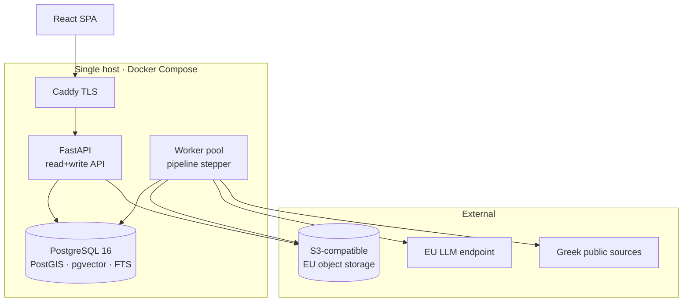

# Topos — Implementation Plan

**Constraint that drives everything:** 1 engineer, implementation performed by an LLM coding
agent (DeepSeek). This is not "a small team" — it is a different engineering discipline.
Every decision below is re-derived from that fact, not inherited from `INITIAL_PROMPT.v2.md`.

---

## 1. Revised parameters

| Parameter | v2 default | **Revised** | Consequence |
|---|---|---|---|
| Engineers | 3 | **1** | No component may require routine operational attention |
| Implementer | human | **LLM agent** | Code must be contract-first, small-file, mock-free-testable |
| Ops capacity | none | **none** | Managed or single-host only |
| Phase 1 duration | 10 wk | **12 wk** | LLM speeds boilerplate, slows novel design; net ≈ 1.5 eng |
| Deployable units | unspecified | **1** | Modular monolith + 1 worker process |
| Datastores | "evaluate" | **1 (Postgres) + object storage** | See ADR-002 |
| Infra budget | €1.5–3k/mo | **€150–400/mo** | Single-host reality |
| LLM runtime budget | €800/mo | **€250/mo** steady, €1,200 backfill | See §12 |

**Rule of thumb applied throughout:** if a component would need someone to look at a dashboard
weekly to stay healthy, it is disqualified. There is no one to look.

---

## 2. Architecture decisions

Condensed ADRs. Each states the alternative rejected and why.

### ADR-001 — Modular monolith, single Python process family
**Decision:** one FastAPI app + one worker binary, deployed as two containers from one image.
Modules are enforced-boundary packages, not services.
**Rejected:** microservices. With 1 engineer, network boundaries convert compile-time errors
into 3am production errors and multiply deployment surface by N. The module boundaries below
are real and enforced by `import-linter`; they can be extracted to services later if a genuine
scaling need appears. None is projected before year 3.

### ADR-002 — PostgreSQL 16 is the only database
Extensions: `postgis`, `pgvector`, `pg_trgm`, `unaccent`, `btree_gin`, `pgcrypto`.
It provides: relational core, geospatial (PostGIS), vector search (pgvector/HNSW), full-text,
fuzzy matching (trigram), JSONB for semi-structured extraction output, graph traversal
(recursive CTEs over an explicit edge table), the job queue (`SKIP LOCKED`), and the audit log.
**Rejected:** Neo4j/Memgraph (a second store to operate and back up, for traversals that are
3-hop and low-volume here), OpenSearch (a JVM cluster and a second index lifecycle for a
corpus that fits Postgres FTS), Qdrant (pgvector suffices at the revised vector count — see
§9), ClickHouse/TimescaleDB (no analytical workload at this volume; partitioned tables are
enough), Redis (Postgres advisory locks + an in-process LRU cover the need; adding a second
stateful service for caching is not worth it at 8 users).
**Reversibility:** high for vectors (re-embed), medium for search, low for the relational core.

### ADR-003 — Python 3.12 backend, TypeScript frontend only
The OCR / STT / NLP / geospatial / Greek-language ecosystem is Python-exclusive. A second
backend language would double the surface an LLM must keep consistent. **Rejected:** Go/Rust
services for collectors — marginal performance gain, large consistency cost.

### ADR-004 — Durable state machine in the database; no workflow engine
Each artifact carries an explicit `pipeline_state`. Workers advance exactly one state per
transaction, idempotently. Retries, backoff and DLQ are columns.
**Rejected:** Temporal (a cluster + its own DB + a mental model), Airflow/Dagster/Prefect
(schedulers built for batch DAGs over datasets, not per-item pipelines with 500k items),
Celery+Redis (a broker to operate; loses transactional coupling with the data).
This is ~300 lines of code the LLM can write correctly from a spec, and it is inspectable with
`SELECT`. Losing a job becomes impossible because enqueue and state change share a transaction.

### ADR-005 — Functional core, imperative shell
Pure functions for everything that decides: scoring, entity-resolution features, geocode
candidate ranking, state transitions, deduplication, evidence aggregation. IO lives only in
adapters at the edges.
**Why this matters more than usual:** an LLM writing tests against mock-heavy code produces
tests that assert the mocks. A pure function is tested with literal inputs and literal outputs,
which an LLM does correctly and which actually prove something. **This is the single highest-
leverage decision for LLM-implemented code.**

### ADR-006 — Three layers per module, not four
`domain/` (pure, no imports outside stdlib+pydantic) → `service/` (orchestration, transactions)
→ `adapters/` (DB, HTTP, LLM, storage). Ports are Protocols, defined in `service/`.
**Rejected:** textbook Clean Architecture with separate entity/usecase/interface-adapter/
framework rings. The extra indirection exceeds what fits usefully in an LLM's working context
and produces navigation cost with no defect reduction at this size.

### ADR-007 — Event sourcing scoped to the Problem aggregate only
Problem state changes are append-only events (`problem_event`); current state is a projection.
**Why here:** evidence defensibility requires knowing exactly what was believed when, and why
it changed. **Why nowhere else:** everything else is fine as mutable rows with an audit log.
**Rejected:** system-wide event sourcing + CQRS + saga. Three separate complexity taxes,
each unaffordable at 1 engineer.

### ADR-008 — Single host, Docker Compose, Caddy
Hetzner (EU, Falkenstein/Helsinki) dedicated or CX-series VM. Caddy terminates TLS.
Postgres runs on the host with PITR to object storage. Compose file is the deployment.
**Rejected:** Kubernetes (a control plane and a YAML dialect for one app), managed Postgres at
first (2–4× the cost; revisit if backup discipline slips — this is the one place to spend money
if anything goes wrong).

### ADR-009 — Contract-first development
Pydantic models, SQL DDL and OpenAPI are written and frozen **before** implementation of each
slice. The LLM implements against a contract; it does not invent one. Contract changes require
an explicit amendment step.

### ADR-010 — Embed the derived layer, not the raw corpus
See §9. Reduces vector count by ~20× and is the reason pgvector suffices.

### ADR-011 — Runtime LLM ≠ implementation LLM
**DeepSeek writes the code. DeepSeek must not process citizen data at runtime** — the API is
non-EU-hosted, which conflicts with constraint L8 (EU residency) once personal data is in
scope. Runtime inference uses an EU-resident endpoint. See §10.

### ADR-012 — No citizen submission channel before Phase 3
It carries the largest legal surface (L4 erasure, moderation, defamation), the largest abuse
surface (astroturfing), and the least early value. Public sources alone justify the product.

---

## 3. Rejected outright

Kafka/Redpanda · Kubernetes · Neo4j · OpenSearch · Qdrant · Redis · Celery · Temporal ·
Airflow · microservices · system-wide CQRS · saga orchestration · GraphQL at Phase 1
(REST is enough for one first-party client; GraphQL is a Phase 3 item when third parties
appear) · a separate "agent framework" (see §10) · social media ingestion (L3; net-negative
until the API terms are re-verified).

---

## 4. System shape



Two processes. One database. One host. Everything else is a library.

### Layering, enforced in CI

```
interfaces/   (http routers, cli)          → may import service, domain
service/      (orchestration, ports)       → may import domain, adapters(protocol only)
adapters/     (postgres, s3, llm, http)    → may import domain
domain/       (pure logic, types)          → imports NOTHING from the project
```

`import-linter` contract fails the build on violation. This is the guardrail that keeps an LLM
from collapsing the layers over 200 commits.

---

## 5. Repository layout

```
topos/
  pyproject.toml              # uv-managed, ruff + mypy strict config
  docker-compose.yml
  Makefile                    # every command the LLM is allowed to run
  ARCHITECTURE.md             # <300 lines, loaded into every LLM session
  .importlinter               # layer contracts
  alembic/versions/
  src/topos/
    domain/                   # PURE. no io. no async. fully unit-tested.
      types.py                # shared value objects, ids, enums
      problem.py              # state machine, transitions
      scoring.py              # score DAG, pure
      resolution.py           # entity-resolution features + clustering
      geo.py                  # candidate ranking, confidence
      evidence.py             # corroboration, independence, decay
      text_gr.py              # Greek normalisation, toponym forms
    service/
      ports.py                # Protocols: BlobStore, LlmClient, Clock, SourceFetcher
      ingest.py  extract.py  resolve.py  score.py  search.py  review.py
      pipeline.py             # the stepper
    adapters/
      db/                     # repositories, queries, unit-of-work
      blob/  llm/  http/  geocode/  ocr/  stt/
      sources/                # one plugin per source type
    interfaces/
      http/                   # FastAPI routers, DTOs
      cli/                    # typer; admin + backfill + eval
    config.py  telemetry.py
  tests/
    unit/                     # domain only. no mocks. fast.
    contract/                 # adapters vs real Postgres (testcontainers)
    golden/                   # Greek fixtures: OCR, extraction, geocode
    e2e/
  web/                        # React + Vite + MapLibre
  eval/                       # labelled Greek eval sets + runner
  docs/
```

**File size limit: 400 lines, enforced in CI.** Not style — context economics. A file the LLM
must read entirely to edit safely should fit alongside its contract and tests.

---

## 6. Core data model

Abbreviated DDL; the full set lives in `alembic/`.

```sql
-- ── Registry ────────────────────────────────────────────────────────────────
CREATE TABLE source (
  id            text PRIMARY KEY,              -- 'diavgeia', 'thess-council'
  kind          text NOT NULL,                 -- selects the plugin
  config        jsonb NOT NULL,                -- validated by the plugin's pydantic model
  cadence       interval NOT NULL,
  rights        jsonb NOT NULL,                -- licence, redistribution, attribution (L10)
  reliability   numeric(3,2) NOT NULL DEFAULT 0.50,
  enabled       boolean NOT NULL DEFAULT true,
  last_ok_at    timestamptz,
  last_error    text,
  created_at    timestamptz NOT NULL DEFAULT now()
);

-- ── Immutable artifacts (WORM once cited) ───────────────────────────────────
CREATE TABLE artifact (
  id            uuid PRIMARY KEY,
  source_id     text NOT NULL REFERENCES source(id),
  uri           text NOT NULL,
  sha256        bytea NOT NULL,
  blob_key      text NOT NULL,                 -- content-addressed object key
  mime          text NOT NULL,
  bytes         bigint NOT NULL,
  fetched_at    timestamptz NOT NULL,
  observed_seq  int NOT NULL DEFAULT 1,        -- source edited in place → new row
  superseded_by uuid REFERENCES artifact(id),
  UNIQUE (source_id, uri, sha256)
);
CREATE INDEX ON artifact (source_id, fetched_at DESC);

-- ── Pipeline (ADR-004) ──────────────────────────────────────────────────────
CREATE TYPE pipe_state AS ENUM (
  'fetched','textified','chunked','extracted','geocoded','resolved','indexed','done','parked');

CREATE TABLE pipeline (
  artifact_id   uuid PRIMARY KEY REFERENCES artifact(id),
  state         pipe_state NOT NULL DEFAULT 'fetched',
  attempts      smallint NOT NULL DEFAULT 0,
  run_after     timestamptz NOT NULL DEFAULT now(),
  locked_until  timestamptz,
  last_error    text,
  updated_at    timestamptz NOT NULL DEFAULT now()
);
-- the entire queue read path:
CREATE INDEX ON pipeline (state, run_after) WHERE state <> 'done';

-- ── Text ────────────────────────────────────────────────────────────────────
CREATE TABLE document (
  artifact_id   uuid PRIMARY KEY REFERENCES artifact(id),
  lang          text NOT NULL,
  text          text NOT NULL,
  text_method   text NOT NULL,                 -- 'native_pdf' | 'ocr:surya@0.4' | 'stt:...'
  quality       numeric(3,2),                  -- CER estimate; gates downstream trust
  pages         jsonb                          -- page → char offsets, for citation
);

CREATE TABLE chunk (
  id            bigserial PRIMARY KEY,
  artifact_id   uuid NOT NULL REFERENCES artifact(id),
  ord           int NOT NULL,
  span          int4range NOT NULL,            -- offsets into document.text  (L5)
  text          text NOT NULL,
  tsv           tsvector GENERATED ALWAYS AS (to_tsvector('greek_cfg', text)) STORED,
  UNIQUE (artifact_id, ord)
);
CREATE INDEX ON chunk USING gin (tsv);
CREATE INDEX ON chunk USING gin (text gin_trgm_ops);

-- ── Provenance of every LLM/model invocation (§9 of the brief) ──────────────
CREATE TABLE extraction_run (
  id            uuid PRIMARY KEY,
  artifact_id   uuid NOT NULL REFERENCES artifact(id),
  prompt_ver    text NOT NULL,
  model         text NOT NULL,
  params        jsonb NOT NULL,
  started_at    timestamptz NOT NULL,
  cost_eur      numeric(10,6) NOT NULL DEFAULT 0,
  tokens_in     int, tokens_out int,
  ok            boolean NOT NULL
);

-- ── Claims: atomic, immutable, span-anchored ────────────────────────────────
CREATE TABLE claim (
  id            uuid PRIMARY KEY,
  run_id        uuid NOT NULL REFERENCES extraction_run(id),
  artifact_id   uuid NOT NULL REFERENCES artifact(id),
  span          int4range NOT NULL,            -- exact evidence locus
  predicate     text NOT NULL,                 -- 'problem.statement', 'authority.responsible'
  value         jsonb NOT NULL,
  confidence    numeric(3,2) NOT NULL,
  retracted_at  timestamptz                    -- retraction path, never DELETE
);
CREATE INDEX ON claim (artifact_id) WHERE retracted_at IS NULL;

-- ── Problems: event-sourced (ADR-007) ───────────────────────────────────────
CREATE TABLE problem (                          -- projection, rebuildable
  id            uuid PRIMARY KEY,
  title         text NOT NULL,
  category      text NOT NULL,
  status        text NOT NULL,
  geom          geometry(Point,4326),
  geo_conf      numeric(3,2),
  authority_id  uuid REFERENCES authority(id),
  first_seen    timestamptz NOT NULL,
  last_seen     timestamptz NOT NULL,
  version       int NOT NULL DEFAULT 1
);
CREATE INDEX ON problem USING gist (geom);

CREATE TABLE problem_event (
  id            bigserial PRIMARY KEY,
  problem_id    uuid NOT NULL,
  seq           int NOT NULL,
  kind          text NOT NULL,   -- created|corroborated|merged|split|status|retracted
  payload       jsonb NOT NULL,
  actor         text NOT NULL,   -- 'system:resolver@v3' | 'user:<id>'
  at            timestamptz NOT NULL DEFAULT now(),
  UNIQUE (problem_id, seq)
);

CREATE TABLE problem_claim (
  problem_id uuid NOT NULL, claim_id uuid NOT NULL,
  role text NOT NULL, weight numeric(3,2) NOT NULL,
  PRIMARY KEY (problem_id, claim_id)
);

-- ── Authority = office, never a person (constraint L1) ──────────────────────
CREATE TABLE authority (
  id uuid PRIMARY KEY,
  name text NOT NULL,            -- 'Δήμος Θεσσαλονίκης — Δ/νση Βιώσιμης Κινητικότητας'
  level text NOT NULL,           -- municipality|region|ministry|utility|other
  jurisdiction geometry(MultiPolygon,4326),
  parent_id uuid REFERENCES authority(id)
);
-- NOTE: there is deliberately no `person` table. See L1/L2.

-- ── Graph edges (ADR-002: recursive CTE traversal) ──────────────────────────
CREATE TABLE edge (
  src_type text NOT NULL, src_id uuid NOT NULL,
  rel      text NOT NULL,
  dst_type text NOT NULL, dst_id uuid NOT NULL,
  valid    tstzrange NOT NULL DEFAULT tstzrange(now(), NULL),
  claim_id uuid REFERENCES claim(id),          -- provenance for every edge
  PRIMARY KEY (src_type, src_id, rel, dst_type, dst_id)
);
CREATE INDEX ON edge (dst_type, dst_id, rel);

-- ── Derived-layer vectors only (ADR-010) ────────────────────────────────────
CREATE TABLE problem_vec (
  problem_id uuid PRIMARY KEY REFERENCES problem(id),
  emb        halfvec(1024) NOT NULL,
  model      text NOT NULL
);
CREATE INDEX ON problem_vec USING hnsw (emb halfvec_cosine_ops);

-- ── Entity resolution, reversible (Command pattern) ─────────────────────────
CREATE TABLE er_decision (
  id bigserial PRIMARY KEY,
  a_id uuid NOT NULL, b_id uuid NOT NULL,
  verdict text NOT NULL,                        -- merge|distinct|unsure
  score numeric(4,3) NOT NULL,
  features jsonb NOT NULL,                      -- explainability of the merge
  actor text NOT NULL,
  reverted_by bigint REFERENCES er_decision(id),
  at timestamptz NOT NULL DEFAULT now()
);

CREATE TABLE review_task (
  id uuid PRIMARY KEY, kind text NOT NULL, payload jsonb NOT NULL,
  priority int NOT NULL DEFAULT 100,
  claimed_by text, claimed_until timestamptz,
  resolved_at timestamptz, resolution jsonb
);
CREATE INDEX ON review_task (priority, id) WHERE resolved_at IS NULL;

CREATE TABLE score_snapshot (
  problem_id uuid NOT NULL, at timestamptz NOT NULL,
  scores jsonb NOT NULL,       -- every node of the DAG, not just the total
  formula_ver text NOT NULL,
  PRIMARY KEY (problem_id, at)
);
```

> **Greek FTS gotcha `[VERIFIED-CONCERN]`:** PostgreSQL's bundled Snowball stemmers do **not**
> include Greek. `to_tsvector('greek')` does not exist out of the box. Phase 0 must create a
> `greek_cfg` text-search configuration from `unaccent` + a hunspell `el_GR` dictionary, and
> fall back to `simple` + `unaccent` + trigram if dictionary quality proves poor. Budget a day
> for this and measure it — it silently degrades all keyword search if skipped.

---

## 7. Module specifications

Each entry: **paradigm → patterns → contract → how it is tested.**

### 7.1 Source Registry
- **Paradigm:** declarative configuration over code.
- **Patterns:** *Registry* (kind → plugin), *Strategy* (per-source parsing), *Abstract Factory*
  (plugin builds its own config model + fetcher + parser).
- **Contract:** a plugin exposes `KIND: str`, `ConfigModel: type[BaseModel]`,
  `fetch(cfg, cursor) -> Iterator[RawItem]`, `parse(raw) -> ParsedDoc`. Nothing else.
- **Why it matters:** the analyst adds a source by writing a YAML row, not by asking the
  engineer. This is the extensibility seam that keeps a solo project alive.
- **Tests:** each plugin ships a recorded HTTP cassette + a golden parsed output.

### 7.2 Collectors
- **Paradigm:** imperative shell, idempotent by construction.
- **Patterns:** *Template Method* (fetch → hash → dedupe → store → enqueue),
  *Retry with exponential backoff + jitter*, *Circuit Breaker* per source,
  *Conditional GET* (ETag/Last-Modified) to keep bandwidth and politeness sane.
- **Failure modes:** silent source edit (→ new `artifact` row, `superseded_by` chain);
  source dead (→ circuit opens, `last_error`, alert); layout change (→ parse golden test fails
  in CI nightly against live fixtures).
- **Tests:** contract tests against recorded cassettes; a nightly *live smoke* job that fetches
  1 item per source and diffs the shape.

### 7.3 Pipeline stepper (ADR-004)
- **Paradigm:** explicit finite state machine; one transaction per transition.
- **Patterns:** *State*, *Chain of Responsibility* over steps, *Idempotent Consumer*.
- **Core loop:**
  ```sql
  UPDATE pipeline SET locked_until = now() + interval '10 min', attempts = attempts + 1
  WHERE artifact_id = (
    SELECT artifact_id FROM pipeline
    WHERE state <> 'done' AND run_after <= now()
      AND (locked_until IS NULL OR locked_until < now())
    ORDER BY run_after FOR UPDATE SKIP LOCKED LIMIT 1)
  RETURNING *;
  ```
- **Guarantees:** at-least-once execution; every step must be idempotent keyed on
  `(artifact_id, state)`. After N attempts → `parked` + a `review_task`. No message is ever
  lost because enqueue and state share the transaction with the data write.
- **Tests:** unit-test the transition table as a pure function; contract-test the locking with
  two concurrent workers against real Postgres.

### 7.4 Document processing (OCR / text)
- **Paradigm:** imperative shell around pure post-processing.
- **Patterns:** *Strategy* selected by MIME + a `native-text-first` ladder:
  embedded PDF text → layout-aware OCR → commercial document AI (paid, last resort).
  *Decorator* for cost accounting.
- **Quality gate:** every document gets a `quality` estimate; below threshold it does not
  proceed to extraction, it goes to review. **Never let bad OCR silently become evidence.**
- **Tests:** golden set of 40 real Greek documents (ΦΕΚ scan, ΚΗΜΔΗΣ notice, council minute,
  news article, photo of a notice) with hand-corrected text; CER/WER regression gate in CI.

### 7.5 Extraction
- **Paradigm:** **functional core** — `parse_extraction(raw_json, doc) -> list[Claim]` is pure
  and exhaustively tested; only the model call is IO.
- **Patterns:** *Adapter* (provider-agnostic client), *Decorator stack* around every call —
  `budget_guard(cache(retry(telemetry(client))))`, *Specification* for schema validation.
- **Schema discipline:** constraints L1/L2 are enforced by the Pydantic model — fields for
  political opinion, health, ethnicity, religion **do not exist**, so they cannot be populated.
  Not a filter. An absence.
- **Span requirement:** every extracted field carries the character offsets that support it.
  A claim without a resolvable span is rejected at the boundary, not stored. This is what makes
  L5 mechanically true rather than aspirational.
- **Tests:** ~150 labelled Greek documents; per-field precision/recall gate; a mutation test
  that corrupts spans and asserts rejection.

### 7.6 Geocoding
- **Paradigm:** pure ranking over impure lookups.
- **Patterns:** *Chain of Responsibility* — gazetteer exact → alias table → trigram fuzzy →
  Nominatim/Pelias → LLM last resort → `unlocated`. Each link returns candidates with a score;
  a pure function fuses and decides.
- **Greek specifics:** genitive→nominative street normalisation (`Εγνατίας`→`Εγνατία`), accent
  folding, Latin transliteration variants, informal neighbourhood polygons (`Τούμπα`) held as a
  hand-curated table with explicit fuzzy boundaries.
- **Output is never a bare point:** `(geom, confidence, granularity)` where granularity ∈
  {address, street, block, neighbourhood, municipality}. The map renders granularity honestly.
- **Tests:** 300 hand-geocoded Greek addresses; accuracy@100m and @1km gates.

### 7.7 Entity Resolution — *the hardest module*
- **Paradigm:** pure feature functions + pure clustering; IO only to fetch candidates.
- **Patterns:** *Blocking* (geohash prefix × category × 30-day window) to avoid O(n²);
  pairwise *feature vector* → calibrated score; *Union-Find* clustering with a threshold;
  ***Command pattern* for merges so every merge is an event that can be reverted** — merges are
  wrong often, and an irreversible merge destroys data.
- **Explainability:** `er_decision.features` stores why, so a reviewer sees "same street, 4 days
  apart, cosine 0.91, same authority" rather than a verdict.
- **Human loop:** scores in the uncertain band become `review_task`s. Reviewer decisions become
  training data for threshold calibration.
- **Tests:** a labelled pair set (2,000 pairs); pairwise F1 gate; a property test asserting
  merge/unmerge round-trips to the original state.
- **Phasing note:** the *schema* ships in Phase 0 (many-to-many `problem_claim`, event log).
  The *algorithm* ships in Phase 2. Retrofitting reversible merges into a 1:1 schema is the
  kind of migration that kills solo projects.

### 7.8 Scoring
- **Paradigm:** pure, versioned, zero IO. A DAG, not 13 siblings.
  ```
  measured:  severity  reach  trend  evidence_strength  tractability  cost
  derived:   impact    = f(severity, reach)
             urgency   = f(trend, severity, deadlines)
             priority  = f(impact, urgency, tractability, cost, leverage)
  ```
- **Patterns:** *Strategy* per formula version; *Snapshot* (`score_snapshot` stores every node,
  so a ranking is always explainable retrospectively).
- **Rules:** every input either present or explicitly `unknown` — never silently zero.
  Weights live in a versioned config file, not in code. Uncalibrated weights are labelled.
- **Gaming resistance:** `reach` and `evidence_strength` use *independent source count*, not
  report count; N reports from one channel count once.
- **Tests:** property-based (monotonicity: more severity never lowers priority), sensitivity
  analysis in CI (report which weights change the top-20), golden ranking of 50 curated cases.

### 7.9 Evidence
- **Paradigm:** append-only; pure aggregation.
- **Patterns:** *Immutable log*, *Bayesian-ish corroboration* over source reliability priors,
  *independence testing* (three outlets republishing one agency wire = one source — detect via
  near-duplicate text hashing before counting corroboration).
- **Retraction path:** retracting an artifact marks its claims, recomputes dependent problems,
  and flags any exported artifact that cited them. Implemented as a reverse traversal of
  `claim → problem_claim → problem`, which the schema makes cheap.

### 7.10 Search
- **Paradigm:** *Facade* over four retrievers; pure fusion.
- **Patterns:** *Strategy* per retriever (FTS, vector, graph, geo, temporal),
  *Reciprocal Rank Fusion* for combination, *Specification* for filter composition.
- **Shape:** lexical first-pass (cheap, high recall on Greek proper nouns which embeddings
  handle badly) → vector rerank over the derived layer → optional graph expansion.
- **Tests:** 100 Greek queries with graded relevance; nDCG@10 regression gate.

### 7.11 API
- **Paradigm:** CQRS-*lite* — read endpoints hit denormalised projections, writes go through
  services. No separate read store, no event bus.
- **Patterns:** *DTO* separation from domain types (never leak the ORM), *Unit of Work* per
  request, *Problem Details* (RFC 9457) for errors.
- **Auth:** OIDC via an external IdP (no password handling in-house), RBAC with 4 roles
  (admin, analyst, reviewer, viewer) + ABAC on constituency for future multi-tenancy.

### 7.12 Frontend
- **Paradigm:** container/presentational; server state is not client state.
- **Patterns:** TanStack Query for server state, URL as the source of truth for filters/map
  viewport/selection (shareable links are a core workflow), MapLibre GL + deck.gl for layers.
- **Design direction:** editorial/data-dense, not a default dashboard grid. Uncertainty is
  drawn (fuzzy halos for low geo-confidence), never hidden. Every score is one click from its
  explanation.

---

## 8. The one screen that matters

Phase 1 ships exactly one workflow well: **"what changed since I last looked, and what should
I raise in the 10am meeting."** Ranked list + map + drill-through to the source span. Anything
that does not serve that is Phase 2.

---

## 9. Why pgvector is enough (ADR-010)

Naive plan: embed every chunk. 500k docs × ~30 chunks = 15M vectors → HNSW index far beyond a
single-host memory budget.

**Instead:** raw chunks get **lexical** indexing only (FTS + trigram — which is also what works
best for Greek proper nouns and administrative identifiers). Embeddings are computed only for
the **derived layer**: problem statements, document summaries, and claim values. That is
~200k–800k vectors at year 2.

At 1024-dim `halfvec`, 800k vectors ≈ 1.6 GB raw + HNSW overhead — comfortable on a 32–64 GB
host. Semantic search over *problems* is also what users actually ask for; nobody searches for
a raw chunk. If dimensionality pressure appears, Matryoshka-truncate to 512.

This single decision removes the need for a dedicated vector database.

---

## 10. AI layer

**Not an agent framework.** Most of the "agents" in the original brief are deterministic steps.
Classification:

| Capability | Tier | Rationale |
|---|---|---|
| Fetch, dedupe, hash, schedule | deterministic | trivially so |
| Geocode, blocking, clustering, scoring, alerting, routing | deterministic / classical ML | must be reproducible and auditable |
| Language ID, quality estimation, near-dup detection | classical ML | cheap, fast |
| Extraction, summarization, OCR correction, translation | **LLM, single-shot, structured output** | no planning required |
| "Answer this question over the corpus" | **LLM, retrieval-grounded, multi-step** | the only genuinely agentic surface |

That yields **one** agentic component (the grounded analyst Q&A) instead of 28. Everything else
is a function call with a prompt.

**Client design:** a `LlmClient` Protocol with a decorator stack —
`BudgetGuard` (hard monthly ceiling; degrades to queue-and-defer, never overspends) →
`Cache` (keyed on `sha256(prompt_ver + model + input)`; backfill reruns cost ~0) →
`Retry` → `Telemetry` (every call written to `extraction_run`).

**Provider (ADR-011):** runtime inference must be EU-resident. Evaluate `[UNVERIFIED — verify
terms and Greek quality before committing]`: Azure OpenAI in a EU region under DPA; Mistral
(EU-hosted); self-hosted Qwen/Meltemi on the same box for low-value bulk passes. Two-tier
routing: cheap model for the 90% of documents that are routine, strong model where the cheap
model's confidence is low or the document is high-stakes. Measure the split — it is the
difference between €250/mo and €2,000/mo.

**Prompt injection (§14 of the brief):** every ingested document is untrusted input. Extraction
prompts must place document text in a delimited, clearly-labelled untrusted region; outputs are
schema-validated; any output containing instruction-like content or a span that doesn't
resolve is rejected. Add an injection canary to the golden set so regressions are caught.

**Evaluation is a Phase-0 deliverable, not Phase 3.** Without an eval set you cannot tell
whether a prompt change improved anything, and an LLM implementer will happily "improve"
prompts into worse ones. Minimum viable: 150 labelled documents, 300 geocodes, 100 queries,
2,000 ER pairs. Built by the domain analyst over Phase 1, gated in CI from Phase 2.

---

## 11. Working with an LLM implementer

This section is as load-bearing as the architecture. Known failure modes and countermeasures.

| Failure mode | Countermeasure |
|---|---|
| Architectural drift over many sessions | `ARCHITECTURE.md` ≤300 lines pasted into every session; `import-linter` fails the build on layer violation |
| Invents APIs that don't exist | Contract-first (ADR-009): types + DDL + OpenAPI frozen before implementation |
| Writes mock-heavy tests that assert nothing | Functional core (ADR-005): the logic under test is pure, tested with literals |
| Silent scope creep | One vertical slice per task, ≤3 files, ≤400 LOC, with the acceptance test written **first** |
| Inconsistent patterns across modules | This document names the pattern per module; deviation requires an ADR |
| Plausible-but-wrong Greek handling | Golden fixtures with hand-verified Greek; no Greek behaviour is accepted without a fixture |
| Loses track of what's done | `docs/PROGRESS.md` updated at the end of every slice; the task list is the source of truth |
| Large refactors that break everything | Refactors are their own slices, behaviour-preserving, with the test suite green before and after |

**Task template** given to the implementer for every slice:

```
CONTEXT   ARCHITECTURE.md + the module's CONTRACT.md + the relevant DDL
GOAL      one sentence
FILES     exact paths it may create or modify — nothing else
CONTRACT  the types/signatures, already written
DONE WHEN `make check` passes and tests/<path>::<test> passes
FORBIDDEN new dependencies, schema changes, touching other modules
```

**`make check` runs:** `ruff` · `mypy --strict` · `import-linter` · file-length check ·
`pytest` · `alembic check`. Merge is blocked on it. This is the entire quality system, and it
must exist before the first feature slice.

---

## 12. Phase plan

### Phase 0 — Foundations (weeks 1–3)
The most important weeks. Nothing here is user-visible and skipping it is fatal.

1. Repo skeleton, `pyproject`, ruff/mypy-strict, `import-linter` contracts, `make check`, CI.
2. Docker Compose: Postgres 16 + extensions, MinIO (local S3), app, worker, Caddy.
3. Alembic baseline: the schema in §6.
4. **`greek_cfg` text-search configuration + measurement** (see §6 gotcha).
5. Domain types + the pipeline state machine as a pure function, fully unit-tested.
6. The stepper loop + concurrency contract test.
7. `LlmClient` Protocol + decorator stack + `extraction_run` accounting.
8. Blob store adapter (content-addressed).
9. `ARCHITECTURE.md`, per-module `CONTRACT.md` stubs, `PROGRESS.md`.
10. One source end-to-end as a walking skeleton: **Διαύγεια → artifact → text → chunk →
    one extracted claim → visible via `curl`.**

**Gate:** the walking skeleton runs on the real host, `make check` is green, cost per document
is measured.

### Phase 1 — Useful to one person (weeks 4–12)
Scope: **text-only public sources. No OCR. No audio. No citizen channel. No ER algorithm.**

- 6–8 collectors: Διαύγεια, ΚΗΜΔΗΣ, Δήμος Θεσσαλονίκης announcements, Περιφέρεια ΚΜ, ΦΕΚ
  (native-text only), 2–3 local news feeds, ΔΕΔΔΗΕ outages.
- Extraction with the frozen schema + span enforcement.
- Geocoding chain with the curated Thessaloniki gazetteer.
- Problems created 1:1 from claims (no cross-source merging yet — **counts are labelled
  "mentions", not "problems", so the UI does not lie about a number ER will later change**).
- Search: FTS + geo + filters.
- The one screen from §8: ranked list, map, timeline, source drill-through with highlighted span.
- Auth (OIDC), 4 roles, audit log.
- Deployed, backed up (PITR verified by an actual restore drill), Prometheus + Grafana on-host,
  alerts to the engineer's phone.

**Gate:** the domain analyst uses it for a week and reports it beat reading feeds manually.
If it does not, stop and fix that before Phase 2.

### Phase 2 — Trustworthy (weeks 13–26)
- OCR pipeline + quality gates + the Greek golden set.
- **Entity resolution**: blocking, features, clustering, reversible merges, review queue.
  Mentions become real deduplicated problems.
- Scoring DAG + snapshots + sensitivity analysis + explanations in Greek.
- Evidence engine: corroboration with independence testing, contradictions, retraction path.
- Human review UI + the correction→eval feedback loop.
- Historical backfill (~500k docs) with the cache making reruns cheap.
- Full eval suite gating CI.

**Gate:** measured extraction/geocode/ER quality published; the analyst trusts the ranking.

### Phase 3 — Complete (weeks 27–44)
- Speech pipeline: council recordings, diarization, timecode-anchored citations.
- Knowledge graph traversal + graph explorer UI.
- Recommendation engine with human approval gate (L6) and funding-programme matching.
- Citizen channel (PWA) **with** moderation, abuse detection, consent/erasure machinery (L4),
  and the DPIA completed first (L9).
- GraphQL + MCP server + webhooks for third parties.

### Phase 4 — Multiple constituencies (week 45+)
- ABAC tenancy, per-tenant gazetteers and source sets, tenant-scoped everything.
- Forecasting and anomaly detection — **only after** two years of clean data exist. Building
  forecasting on Phase-1 data would forecast the ingestion pipeline's own artefacts.
- Revisit the extraction split: at scale, fine-tuning a small Greek model on accumulated
  labelled data likely beats the API cost.

---

## 13. Cost model (steady state, Phase 2)

| Item | € / month | Note |
|---|---|---|
| Host (Hetzner, 16 vCPU / 64 GB / NVMe) | 60–110 | Postgres + app + worker |
| Object storage + egress | 15–40 | ~2 TB |
| Backups (separate provider/region) | 15 | do not co-locate with the primary |
| LLM inference | 150–250 | with cache + two-tier routing; **the volatile line** |
| Geocoding / maps | 0–30 | self-hosted Nominatim + MapLibre keeps this near zero |
| Monitoring, IdP, domain, misc | 20–40 | |
| **Total** | **≈ 270–485** | vs ~€2,500 for the K8s/Kafka/Neo4j shape |

Backfill one-off: ~€900–1,400 depending on OCR strategy. Cache the results — reruns after a
prompt change should hit cache for anything unchanged.

---

## 14. Risk register

| # | Risk | Likelihood | Impact | Mitigation | Residual |
|---|---|---|---|---|---|
| R1 | Entity resolution underperforms; counts and trends are wrong | High | High | Ship as "mentions" in Phase 1; publish measured ER quality; reversible merges; review queue | Medium |
| R2 | Greek OCR too poor to justify backfill | Medium | Medium | Measure on the golden set in Phase 2 **before** spending the backfill budget; native-text-first ladder | Low |
| R3 | LLM cost overrun | Medium | Medium | Hard `BudgetGuard` ceiling that defers rather than overspends; cache; two-tier routing | Low |
| R4 | Solo engineer is the single point of failure | **High** | **High** | Everything in git; `make check` reproduces the build; ADRs record *why*; restore drills quarterly; no hand-configured servers | Medium |
| R5 | LLM implementer produces plausible-but-wrong code | High | Medium | Functional core, contract-first, `make check`, golden fixtures (§11) | Medium |
| R6 | Source layout changes break collectors silently | High | Medium | Nightly live smoke per source; circuit breaker; `last_ok_at` alerting | Low |
| R7 | Prompt injection via an ingested document | Medium | High | Delimited untrusted regions, schema validation, span resolution, injection canaries | Medium |
| R8 | GDPR erasure cannot be executed end to end | Medium | High | Rehearse it in Phase 3 as an automated test before the citizen channel launches | Medium |
| R9 | Built correctly, produces nothing actionable | Medium | **Fatal** | The Phase-1 gate is a human using it for a week — not a demo | Medium |
| R10 | Postgres becomes the bottleneck | Low | Medium | Partition `chunk`/`claim` by time; read replica; the extraction path is CPU/LLM-bound long before the DB is | Low |

**R4 and R9 are the two that actually kill this project.** R9 is mitigated by the Phase-1
gate; R4 by refusing to hand-configure anything.

---

## 15. Definition of done

Per slice: `make check` green · acceptance test passes · `CONTRACT.md` updated if the interface
moved · `PROGRESS.md` updated · no new dependency without an ADR.

Per phase: the gate in §12 met · restore drill performed · costs measured against §13 ·
risk register reviewed · one ADR written for anything that surprised you.

---

## 16. Open questions

1. Are §1's revised parameters right? Document volume and the 12-week Phase 1 are the two most
   load-bearing guesses.
2. Which EU LLM endpoint, verified on Greek and on terms? Blocks Phase 0 item 7.
3. Does a usable hunspell `el_GR` dictionary exist for Postgres FTS, and is its quality
   acceptable? Blocks Phase 0 item 4.
4. Licence terms per source (L10) — must be checked before ingesting, not after.
5. Who is the domain analyst who labels the eval sets? Without that person, quality is
   unmeasurable and the project degrades to vibes. **This is a staffing dependency, not a
   technical one, and it is currently unfilled.**
